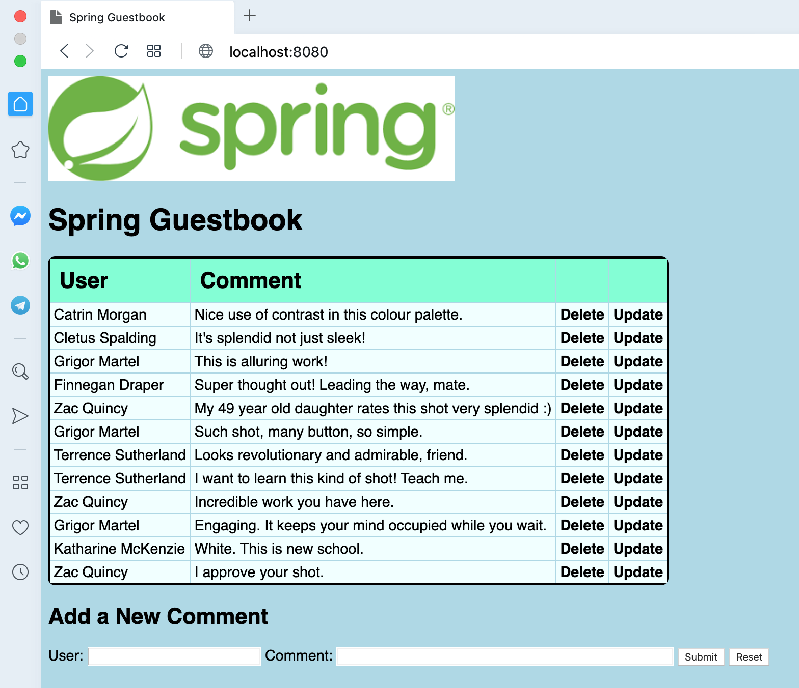

# Spring Guestbook

## A Spring application using an H2 database.

There are two interfaces to the guestbook database, one
web-based and one via an API. See the associated Spring
tutorial for details of the API and how to use it.

Persistence can be added by installed MySQL, modifying
the dependencies in `pom.xml` and tweaking
the settings in the `application.properties` file (example
settings are commented-out in that file).

Spring version 2 and Java 8.

Run with Maven:
```
$ mvn clean spring-boot:run
```
The app will then be available on port 8080, that is
http://localhost:8080/ .

## Screen shot



